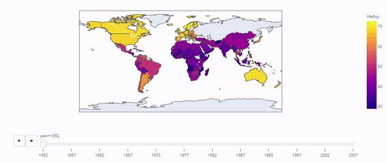
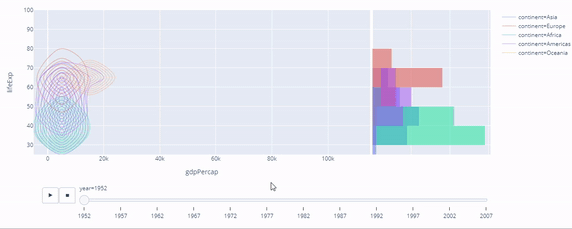
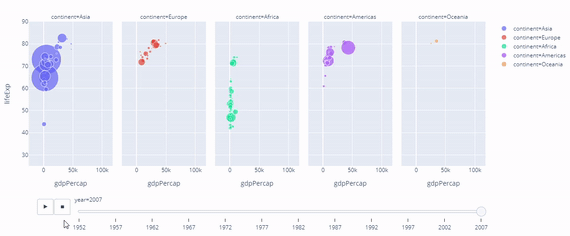
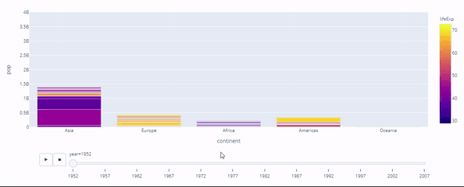

# Visualizacao-de-dados-animados-python - Project finished.
Project finished. Projeto com o framework Plotly onde consigo gerar uma visualização animada dos dados do dataframe escolhido, esse projeto em questão analisei a taxa de mortalidade nos paises do mundo.

 
  
 
    
    
    
    
   
